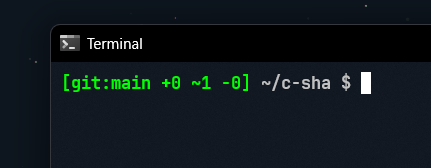

## **[\$PROFILE](profile.ps1) – Enhanced PowerShell Interface**

> Copy the contents of `profile.ps1` into your PowerShell profile (`$PROFILE`).
> To edit your profile, run:
>
> ```powershell
> notepad $PROFILE
> ```
>
> Then reload it with:
>
> ```powershell
> . $PROFILE
> ```
>
> **Note:** The Git status segment only appears when you are inside a Git repository.

---

### **Preview**

The prompt format:
`[git:current_branch +added ~modified -deleted] ~/directory_base_name $`



---

### **Additional Git Info**

> \[!Note]
> You can enable display of ahead/behind information by uncommenting the following lines in your profile:

```powershell
#if ($ahead -gt 0 -or $behind -gt 0) {
#    $gitInfo += " (↑$ahead ↓$behind)"
#}
```
